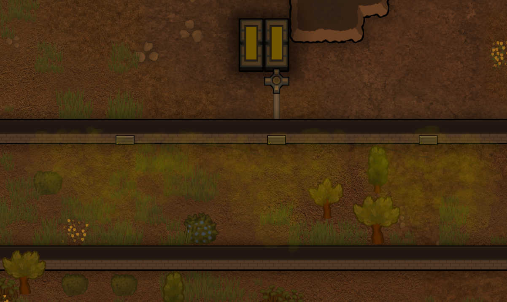
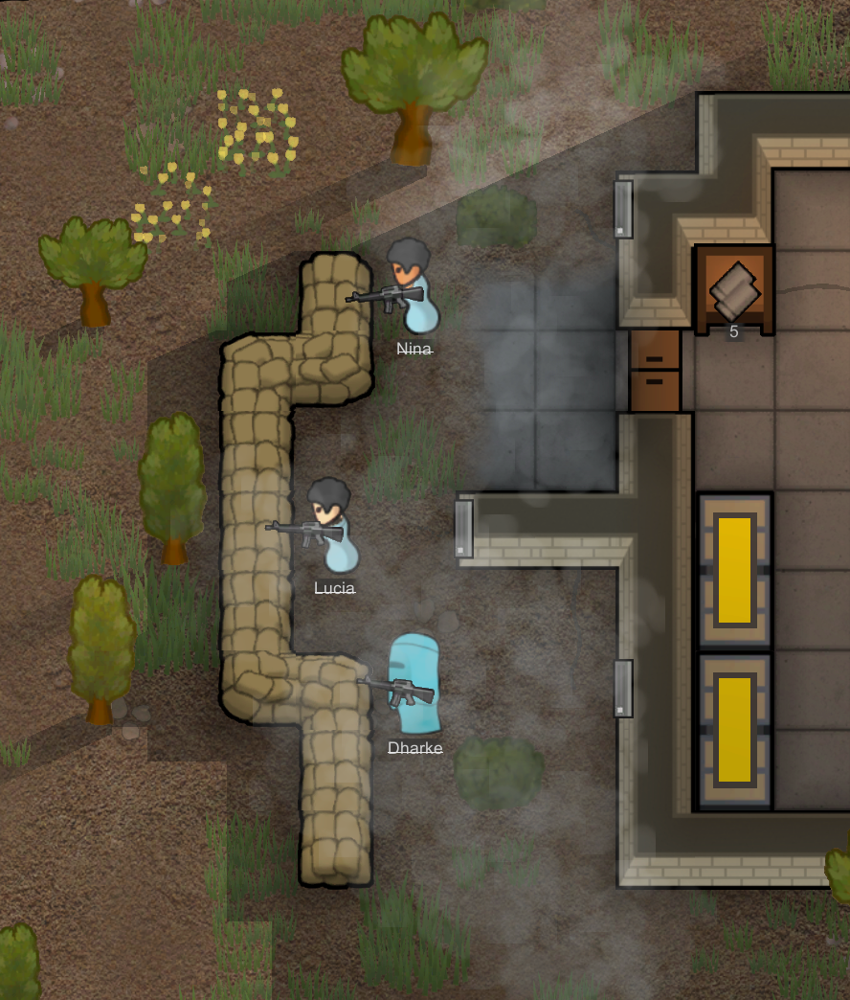

# RimWorld / Gas Vents

A RimWorld mod that adds gas-releasing electrically powered vents.

Find it [here](https://steamcommunity.com/sharedfiles/filedetails/?id=3001066867) on the Steam workshop.

This utilizes my [Simple Custom Gas Framework](https://github.com/NachoToast/SimpleCustomGasFramework) for compatibility with custom gas types, a version of this mod for only the vanilla gas types that does not require this framework can be located on the **vanilla** branch.

